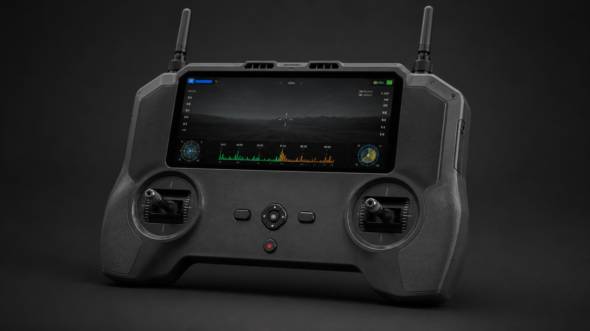
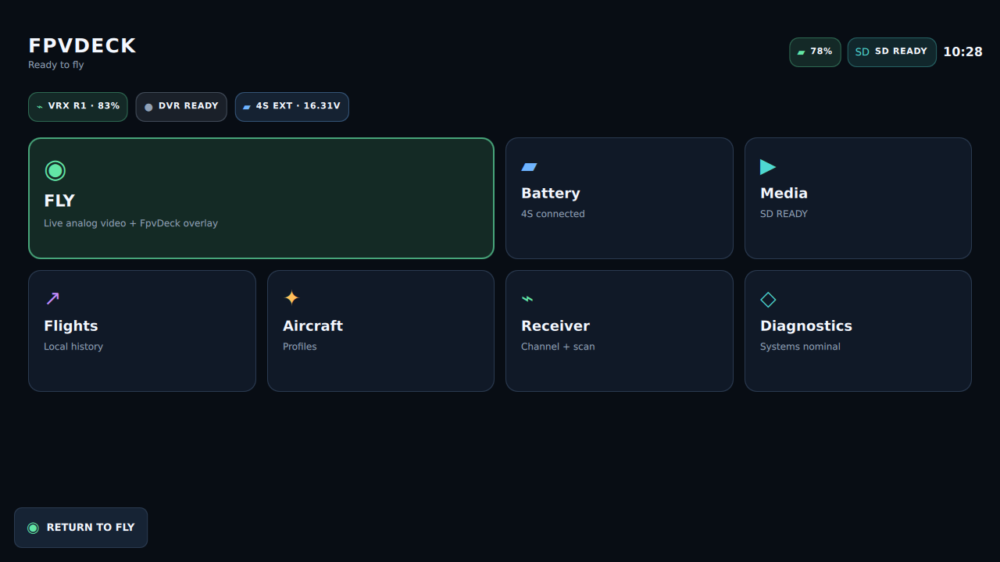
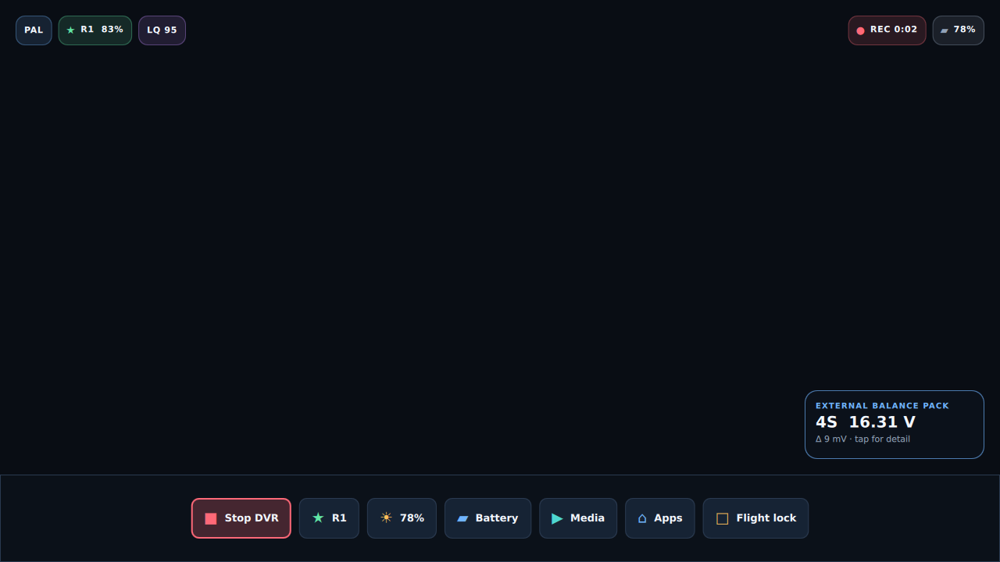
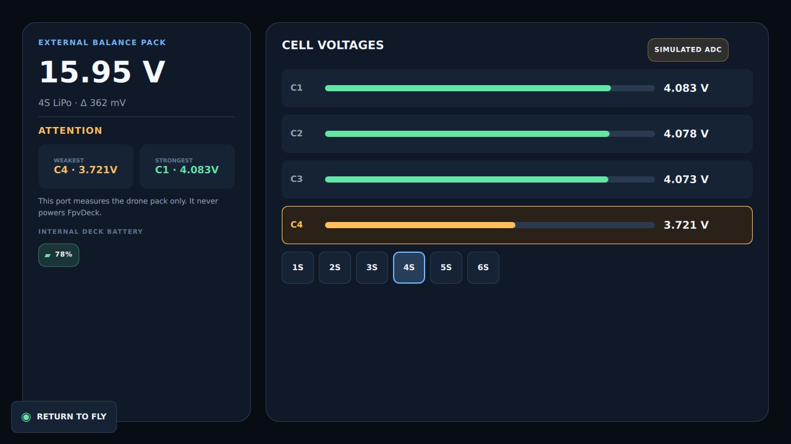
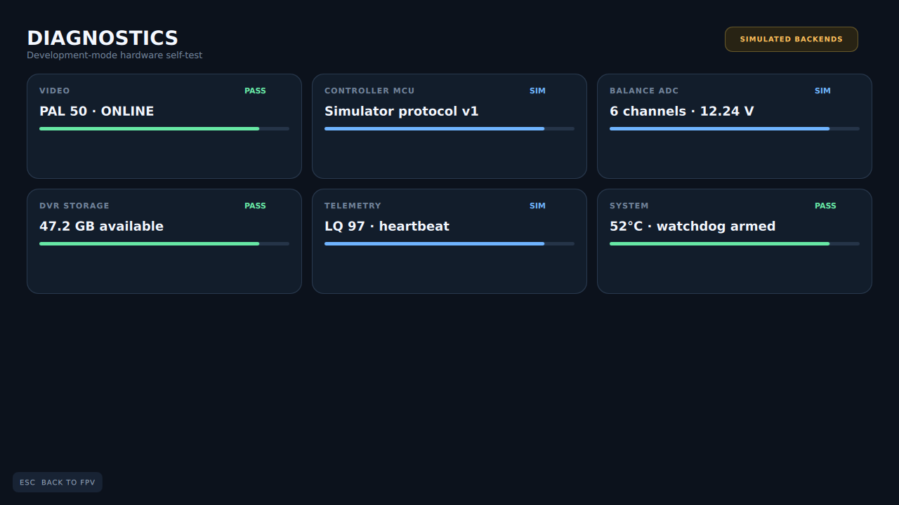

<p align="center">
  
</p>

<p align="center">
  <a href="https://github.com/wiekstras/FpvDeck/actions/workflows/ci.yml"></a>
  
  <a href="LICENSE"></a>
</p>

# FpvDeck

FpvDeck is a custom FPV handheld computer and radio built around a RadioMaster
T8L donor controller. It keeps ELRS control independent while adding low-latency
analog video, a large HD color display, modern RGB overlays, local flight data,
and modular applications in one field-ready device.

The desktop product shell works today without hardware. The RF, video-decoder,
power, battery-measurement, and enclosure designs remain engineering prototypes;
this repository calls that distinction out rather than presenting renders as
finished hardware.

## Preview



> **CONCEPT RENDER — NOT FINAL DESIGN OR CAD.** Dimensions, component fit,
> thermal behavior, antenna placement, and T8L geometry are unverified. The
> larger high-mounted screen and pinch-grip clearance express product direction.

| Desktop product shell | FPV view: source pixels + independent RGB overlay |
| --- | --- |
|  |  |
| Balance checker simulation | Diagnostics and backend status |
|  |  |

All screenshots are generated by the real application with deterministic test
data. [Media](docs/assets/ui/media.png) and
[flight-history](docs/assets/ui/flights.png) captures are also reproducible.

## Features

- T8L gimbals, switches, ELRS control electronics, and RF path reused where safe
- analog FPV reception with the Betaflight OSD preserved in the received image
- GPU-composited full-color widgets, menus, notifications, and applications
- large, high-mounted HD-class display direction with physical-button control
- pre-overlay DVR architecture and optional composited recording branch
- protected external 1S–6S balance checking; 8S remains under evaluation
- local SQLite flight, battery, aircraft, and recording data
- removable-card media workflow, controller diagnostics, and fault simulation
- real/simulated backend boundary for every hardware-dependent service
- independent real-time MCU for measurement, controls, power, and watchdog duties

## Architecture


The flight-control path never depends on Linux. Analog video flows from the
aircraft through diversity VRX and a field-rate decoder; the Linux compositor
adds FpvDeck graphics without altering the embedded Betaflight OSD. Editable
[overall](docs/assets/diagrams/overall-system.mmd),
[video](docs/assets/diagrams/video-pipeline.mmd),
[power](docs/assets/diagrams/power-architecture.mmd), and
[software](docs/assets/diagrams/software-architecture.mmd) diagram sources live
with the documentation.

## Applications

| Application | Current state |
| --- | --- |
| FPV | 🧪 file video, signal faults, DVR state, telemetry and battery overlay simulated |
| Balance Checker | 🧪 1S–6S simulation and battery math implemented; 📐 protected ADC frontend in design |
| Media | 🧪 removable-card browser showcase; 🚧 mount/playback service pending |
| Flights | ✅ SQLite schema, migrations, deterministic history, and persistence |
| Batteries | 🧪 application shell/showcase data; 🚧 persistent inventory workflow pending |
| Aircraft | 🧪 application shell; 🚧 persistent profile workflow pending |
| DVR | 🧪 state/error simulation; 📐 hardware encoder pipeline pending |
| Diagnostics | ✅ UI and simulated backend status; 📐 HIL/self-test integration pending |
| Settings | ✅ physical-input-friendly application shell; 🚧 durable settings pending |

## Simulator

FpvDeck is deliberately useful before physical hardware exists. On a supported
Linux development machine, install the packages in [BUILD.md](docs/BUILD.md),
then run:

```sh
./scripts/demo       # deterministic showcase home
./scripts/dev        # normal development session
./scripts/check      # build and run the complete automated test suite
```

The generated PAL/NTSC-style source contains synthetic “quad OSD” pixels. FpvDeck
widgets are rendered above it as a separate layer. Use `M` for the application
menu, `R` for DVR, `B` for the battery widget, `L` for signal loss, `F10` for the
simulator panel, and `Esc` to return. Critical operation does not require touch.

Rebuild the committed previews with `./scripts/screenshot-demo`.

## Hardware

| Subsystem | Prototype direction | Status |
| --- | --- | --- |
| T8L / ELRS | preserve donor control/RF path; characterize read-only interfaces | ❓ teardown measurements required |
| Compute | Raspberry Pi CM4 for bench; i.MX 8M Plus production lead | 📐 selected direction, not validated |
| Display | 5-inch Pi DSI bench fallback; 5.5–6.25-inch outdoor target | ❓ larger panel shortlist reopened |
| Analog VRX | Skyzone SteadyView X module first | 📐 selected pending RF/latency A/B tests |
| CVBS decoder | ADV728x-M evaluation path; TW9992 production investigation | 📐 bench hardware and driver work pending |
| Controller | STM32G0B1 family over versioned COBS/CRC protocol | 🧪 codec implemented; 📐 target firmware pending |
| Balance ADC | ADS7066 vs ADS8688A evaluation | 📐 protected frontend A/B test required |
| Power | protected 2S2P 18650, managed shutdown, modular rails | 📐 estimates only; T8L input unknown |

No PCB or battery frontend in this repository is approved for fabrication or pack
connection. Unknown interfaces are labeled **UNKNOWN** or **NEEDS MEASUREMENT**.

## Project status

Legend: ✅ implemented · 🚧 in development · 🧪 simulated · 📐 hardware design ·
❓ research/unconfirmed

- ✅ desktop Qt 6/QML application, service interfaces, SQLite migrations, and CI
- 🧪 video, balance battery, telemetry, input, DVR, and failure scenarios
- 📐 low-latency bench chain, controller I/O PCB, power, and protected analog input
- ❓ T8L internal pinout/mechanics and final display/enclosure geometry

This is pre-release engineering work, not a product ready for flight-critical
reliance. Performance targets in the documents are gates, not measured claims.

## Development

The monorepo keeps firmware, Qt/C++ software, protocols, KiCad projects, research,
and tests together. Start with [CONTRIBUTING.md](CONTRIBUTING.md) and
[DEVELOPMENT.md](docs/DEVELOPMENT.md). Important decisions are recorded in
[ENGINEERING_LOG.md](ENGINEERING_LOG.md), while incomplete work remains in
[TODO.md](TODO.md).

## Documentation

- [System architecture](docs/ARCHITECTURE.md) · [hardware architecture](docs/HARDWARE_ARCHITECTURE.md)
- [Video pipeline](docs/VIDEO_PIPELINE.md) · [latency budget and measurement](docs/LATENCY.md)
- [T8L integration](docs/T8L_INTEGRATION.md) · [safe reverse engineering](docs/REVERSE_ENGINEERING.md)
- [Power](docs/POWER.md) · [battery measurement](docs/BATTERY_MEASUREMENT.md)
- [Software](docs/SOFTWARE_ARCHITECTURE.md) · [app API](docs/APP_API.md) · [MCU protocol](docs/MCU_PROTOCOL.md)
- [Simulator](docs/SIMULATOR.md) · [testing](docs/TESTING.md) · [risk register](docs/RISK_REGISTER.md)
- [Component decisions](hardware/research/COMPONENT_SELECTION.md) · [living BOM](hardware/bom/PROTOTYPE_1.csv)

## Roadmap

1. **v0.1 simulator:** complete persistent app workflows, bounded video/DVR tests,
   and reproducible desktop packaging.
2. **v0.2 bench:** measure VRX → decoder → compositor → display latency and RF,
   ADC, power, display, and shutdown behavior.
3. **v0.3 controller PCB:** protected measurement, MCU, controls, sequencing,
   connectors, debug, and manufacturing self-test.
4. **v0.4 integrated prototype:** measured compute carrier and enclosure revision.
5. **v1.0:** field-validated, documented, serviceable hardware.

See the maintained [roadmap](docs/ROADMAP.md) and [TODO](TODO.md) for acceptance
criteria rather than release-date promises.

## License

The existing repository license is [MIT](LICENSE). Hardware release licensing
will be clarified before fabrication files are published as production-ready.
