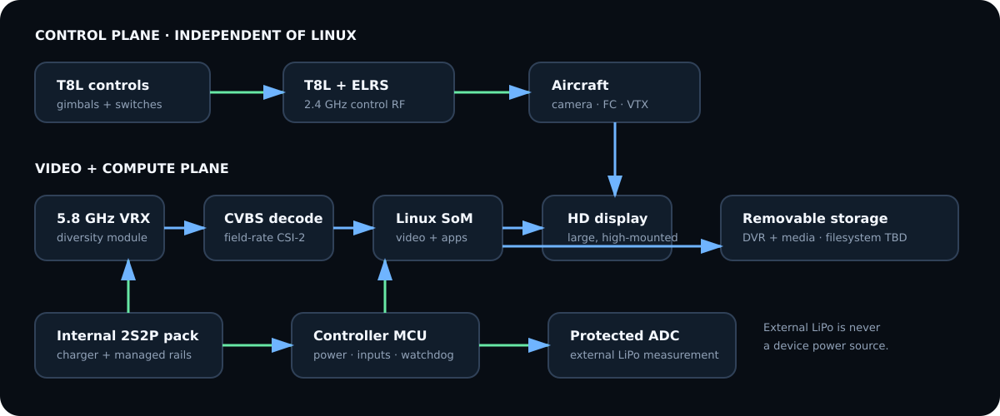

# System architecture



FpvDeck keeps the safety-critical control radio independent of Linux. The T8L
donor remains able to generate and transmit ELRS control even when the compute
side is powered down, booting, overloaded, or crashed.

```text
                         CONTROL PLANE (independent)
 T8L gimbals/switches ──> T8L controller ──> ELRS 2.4 GHz ──> aircraft
                                  │ optional, read-only status/telemetry later
                                  ▼
                         MCU hardware controller
                                  │ COBS + CRC protocol
                                  ▼
 FPV camera -> FC OSD -> VTX -> dual VRX -> CVBS decoder -> CSI-2 -> Linux SoM
                                                                    │
                     ┌──────────────────────────────────────────────┤
                     │ VideoService: bounded live path              │
                     │ Recorder branch: pre-overlay encode          │
                     │ Qt Quick/DRM compositor: color UI overlay     │
                     └──────────────────────────────────────────────┤
                                                                    ▼
                                                               MIPI DSI LCD
```

The received Betaflight OSD is pixels in Layer 1. FPVDeck never tries to recreate
or insert that analog OSD. Layer 2 contains glanceable system widgets; Layer 3
contains transient menus/apps. Secondary service failure must not block Layer 1.

## Prototype architecture

Prototype 0 is the desktop simulator in this repository. Prototype 1 is a CM4
development carrier, supported 720×1280 DSI panel, ADV7280A-M/ADV7282-M evaluation
hardware, standalone SteadyView X VRX, STM32G0 development board, and protected
ADC evaluation hardware. Each module remains replaceable.

Prototype 2 is a Controller-I/O PCB: MCU, protected battery measurement, controls,
power button/sequencing logic, fans/temperature, debug, and module connectors.
Prototype 3 is a compute carrier. Prototype 4 integrates only interfaces whose
layout, thermal, EMC, and latency behavior has been proven on the bench.

## Performance gates

| Metric | Initial target | Release method |
| --- | ---: | --- |
| CVBS connector to visible photons | p95 ≤45 ms; stretch ≤33 ms | LED/photodiode fixture, ≥1,000 transitions |
| Live video continuity under app crash | no missing live frames attributable to app | fault injection + capture counter |
| UI | 60 Hz when live path has headroom | frame timing trace |
| Video | every source field represented at 50/59.94 Hz | V4L2/DRM sequence correlation |
| DVR start acknowledgement | <500 ms | monotonic event log |
| Channel switch/relock | <500 ms target, measured by mode | RF generator/VTX fixture |
| Warm boot to live video | <8 s target | power-cycle fixture; live path may precede full shell |
| Normal shutdown | database/storage clean after 1,000 cycles | automated power controller |
| FPV runtime | ≥1.25 h target; 1.5 h stretch at typical brightness | measured two-cell pack test |

Targets are engineering gates, not current measured results.
