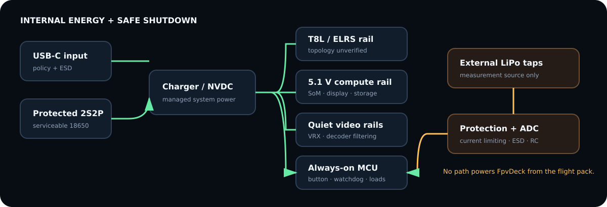

# Power architecture



## Provisional topology

```text
USB-C receptacle + ESD/CC/PD
       -> BQ25792-class 1–4S buck-boost NVDC charger/power path
       -> protected, serviceable 2S2P 18650 pack
              ├─ fused/filtered T8L input (only after original topology verified)
              ├─ TPS55288-class 5.1 V high-current buck-boost -> CM4/display/USB
              ├─ quiet filtered VRX/video rails
              └─ always-on low-power MCU rail -> power button/load switches
```

BQ25792 is an active 1–4 cell, 5 A buck-boost charger with NVDC power path,
integrated FETs/ADC, I²C, 3.6–24 V input, and USB-PD-range OTG. It does not itself
remove the need for correct USB-C policy/protection, pack protection, thermistors,
fusing, cell matching, regulatory work, and safe mechanical cell retention.

TPS55288 is an active four-switch 2.7–36 V buck-boost with programmable current
limit and spread spectrum. Its 16 A figure is switch/inductor current, not a claim
that any board can deliver 16 A at 5 V. Inductor, MOSFETs, copper, thermal design,
stability, peak battery current, and EMI must be calculated and measured.

## First-pass power budget

| Load | Typical estimate | Peak estimate | Confidence |
| --- | ---: | ---: | --- |
| CM4 + eMMC | 3.5 W | 7 W | platform-dependent estimate |
| 5.5–6.25-inch display/backlight | 3.5 W | 7 W | envelope estimate; **NEEDS MEASUREMENT** |
| SteadyView X | 2.9 W | 3.5 W | 12 V × 240 mA published typical |
| decoder + carrier | 0.4 W | 0.8 W | estimate |
| T8L/ELRS | 0.7 W | 1.5 W | **NEEDS MEASUREMENT** |
| MCU/ADC/storage/misc. | 0.8 W | 2 W | estimate |
| **system before conversion loss** | **10.8 W** | **19.8 W** | not measured |

A nominal 2S2P pack using four 3 Ah, 3.6 V cells stores about 43 Wh before pack,
temperature, reserve, age, and conversion derating. At 11–16 W input this suggests
roughly 2.3–3.3 h, so the ≥2.5 h goal is plausible but unproven. A two-cell 2S pack
roughly halves runtime and is not the production baseline.

## Shutdown state machine

Short power press wakes the MCU and enables compute. A normal off request makes
the MCU send `ShutdownRequest`; Linux stops recording, commits SQLite, syncs and
unmounts writable data, then returns `ShutdownReady`. The MCU waits for rail-good/
heartbeat loss and removes the compute load while keeping charger/wake logic alive.

A ≥8 s hold is emergency forced-off. The MCU records the cause and removes power
even without Linux acknowledgement. The next boot runs filesystem/database checks
and presents a recovery notice. Brownout prediction requests an expedited shutdown;
DVR segmentation limits the unrecoverable interval.
