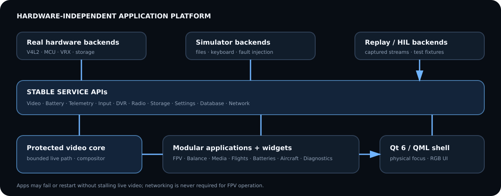

# Software architecture



FPVDeck is a single-purpose Qt 6 application launched directly into a DRM/KMS
session. There is no desktop environment. Systemd owns process lifetime and a
small supervisor restarts noncritical workers independently.

```text
QML apps/widgets
   │ stable QObject APIs, queued signals, immutable snapshots
AppManager ──────────────────────────────────────────────┐
   │                                                     │
Video Battery Telemetry Input DVR Radio Storage Media Interaction System Database
   │                                                     │
real backend / simulated backend / replay backend        │
   └──────────── isolated drivers and worker processes ──┘
```

VideoService and the compositor are the protected core. Network, history,
battery UI, and settings can restart without taking down capture. DVR receives a
tee and cannot exert backpressure. UI effects are disabled under missed-frame or
temperature pressure.

Qt/QML was chosen over Flutter, Electron/web, and a bespoke OpenGL shell. Qt has
mature embedded KMS/Wayland-less deployment, C++/V4L2 integration, a retained
GPU scene graph, physical focus navigation, and SQLite. Electron is rejected for
runtime/boot/memory cost; Flutter's Linux embedded/video interop adds ecosystem
risk; bespoke rendering would spend effort recreating accessibility, text, and
layout infrastructure.

The repository currently implements Battery, Video/VRX, DVR, Telemetry, Input,
Storage, Media, Interaction, System, and Database services. Hardware-dependent
state has a deterministic simulator path. The QML pages consume these QObject
contracts and do not open serial ports, mount cards, or sample ADCs themselves.

InteractionService owns transient FPV controls, flight-lock navigation policy,
and touch-debug state. A lock rejection is explicit and testable. StorageService
models the removable-card lifecycle independently from MediaService playback;
this prevents a media view from inventing mount behavior. SystemService owns
deck power/thermal/connectivity state used by Home and Diagnostics.

The current implementation is one process for desktop iteration. The embedded
architecture will move capture/recording and noncritical workers across bounded
IPC boundaries where failure isolation or privilege separation is justified.
That split must preserve the service contracts rather than exposing driver APIs
to QML.
