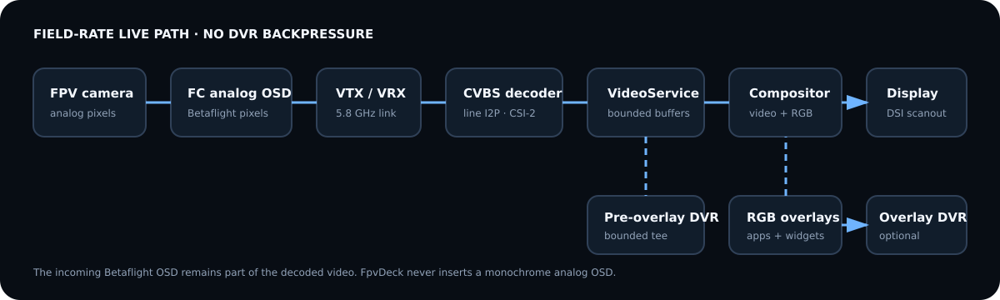

# Video pipeline



## Prototype 0 functional path

```text
Air65 analog VTX -> RC832 Mini RF-to-CVBS -> yellow RCA
  -> Gembird UVG-002 -> Linux V4L2/QCamera (usbtv or uvcvideo)
  -> Qt Quick VideoOutput + independent RGB QML overlay
  -> Raspberry Pi Touch Display 2
```

This is implemented as a selectable `v4l2` VideoService backend. Qt owns the
camera/capture session; the UI continues to consume the same service state as
file and simulated sources. A `QMediaRecorder` tee can write the pre-overlay
camera stream without routing recording frames back through the live UI. This
path is allowed to be slow and buffered: it is evidence for functionality, not
the release pipeline.

Gembird declares two possible chipsets under one MPN. UTV007 uses `usbtv`;
UTVF007 commonly exposes a UVC stream through `uvcvideo` but may squelch noisy
input. Device ID, driver, formats and loss behavior are receipt/bench gates.

`scripts/fpvdeck-video-list` enumerates exact nodes/formats, `scripts/test-video`
validates V4L2 without the application, and `scripts/prototype0` launches real
capture with an explicit fallback to synthetic video when hardware is absent.

## Prototype 1 latency path

```text
Aircraft camera -> Betaflight analog OSD -> 5.8 GHz analog VTX
  -> 5.8 GHz antenna
  -> dedicated SteadyView X analog VRX (RF receiver; not supplied by T8L)
  -> 1 Vpp / 75 Ω CVBS
  -> correctly terminated/protected analog input
  -> ADV7282A-M decoder evaluation path with low-delay line-based I2P
  -> one-lane CSI-2 YUV422
  -> CM4 Unicam/V4L2 capture
  -> DMABUF-backed live queue (depth 1; newest frame wins)
  -> Qt Quick scene graph / DRM-KMS compositor
  -> DSI scanout
```

These are two distinct hardware stages: SteadyView X demodulates 5.8 GHz RF into
composite video, while ADV7282A-M digitizes composite video. The decoder has no RF
receiver. The donor T8L's separate 2.4 GHz ELRS transmitter carries aircraft
control only.

The current EVM path is not purchase-cleared. `EVAL-ADV7282AMEBZ` exposes MIPI
clock/data on SMA connectors, and a reviewed controlled-impedance SMA-to-CM4IO
bridge is still required. This interface gap is tracked rather than represented
as an ordinary cable.

Raspberry Pi's camera documentation explicitly supports ADV728x-M through the
`adv7180` driver and explicitly does not support interlaced input. Therefore I2P
is not optional on this prototype. The Analog Devices I2P uses line interpolation
rather than field/frame storage; its artifacts are accepted in exchange for low
delay. A frame-based software deinterlacer is forbidden in the live path.

The Prototype 0 Qt camera/V4L2 path intentionally transits USB capture. The
Prototype 1 release candidate must instead use a dedicated low-queue V4L2/DMABUF
backend. It must not transit a USB capture
device, encode/decode round trip, GStreamer queue with unspecified depth, or a
desktop window manager.

## Queue policy

- Capture buffers: minimum driver-supported count proven stable; target 2.
- Application live queue: exactly one pending frame; overwrite stale frames.
- Compositor: direct fullscreen KMS/DRM session with no desktop compositor.
- Recorder: independent bounded queue. Recorder overload drops/flags recording
  frames and never back-pressures live video.
- Faults: hold last valid frame briefly, then show explicit `NO VIDEO`; never let
  a decoder's free-run blue/black output masquerade as a valid RF lock.

## DVR

V1 records pre-overlay YUV through the CM4 H.264 hardware encoder. Five-minute
segments and a journaled metadata transaction limit power-loss damage. Container
choice will be tested between fragmented MP4 and Matroska; normal MP4 requiring a
final `moov` write is not acceptable without fragmentation/recovery.

Composited recording is a later option. It requires an additional offscreen render
or writeback path and must be disabled automatically if it threatens the live
budget. Pre-overlay recording remains the canonical evidence stream.

## PAL/NTSC policy

Autodetect is accepted for general use; a user-forced standard is available for
problem sources. The service publishes detected/forced standard, lock state,
field rate, frame sequence, decoder error counters, and last-good-frame time.
PAL, NTSC-M, weak sync, nonstandard line length, unplug/replug, and standard
change are required bench cases.
